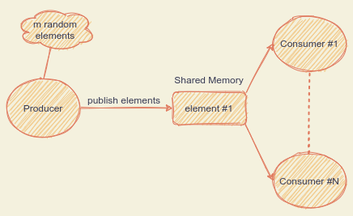

# Producer-Consumer Problem

  

<strong>One producer and n consumers with shared memory</strong>

In this simulation, one producer sends m elements to n consumers. These elements are stored in a shared memory segment with a capacity of one element. Each element contains a random int and a timestamp. At the end of this simulation, each consumer writes its pid, the m elements and its running average time in a shared results.txt file. 
  
Note: running average time = the time needed to collect all the m items.

## How It Works
<strong>Semaphores:</strong> 
* full: &nbsp;&nbsp;&nbsp;&nbsp;  [0, n], initial value is 0
* empty: [0, n], initial value is 0
* mutex:&nbsp;&nbsp;0||1, &nbsp;initial value is 1(for the shared results.txt file)

<strong>Operations:</strong> 
* semDown(semaphore): Reduce semaphore's value by one
* semOpN(semaphore, value): Set semaphore's value
* semWaitUntilZero(semaphore): Block process till semaphore's value becomes zeros

<strong>Producer:</strong> 
Publish a new element to the shared memory segment, set(semOpN) full and empty semaphores to n and wait(semWaitUntilZero) empty semaphore to become zero(wait all consumers to read the current element).  Repeat this process m times.

<strong>Consumers:</strong> 
Reduce(semDown) full semaphore, get an element from the shared memory segment, wait(semWaitUntilZero) full semaphore to become zero(wait all consumers to read the current element), and reduce(semDown) the empty semaphore.   Repear this process m times. 

Note: When the empty semaphore becomes zero, producer adds a new element into the shared memory segment.  

## Compilation
1. make
2. ./test

## Author
* Petropoulakis Panagiotis petropoulakispanagiotis@gmail.com
